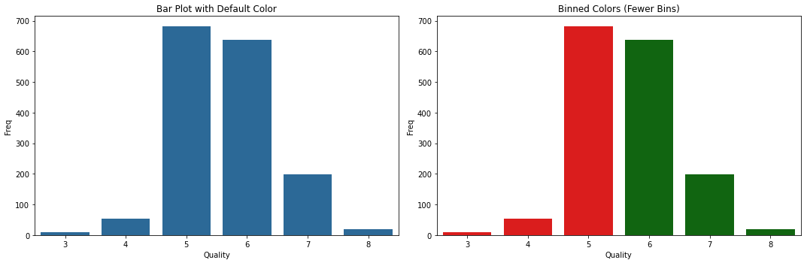

<h1 align="center">Predicting Wine Quality From Physical and Chemical Properties</h1>

 
<a href="https://nbviewer.org/github/BrianMillerS/wine_quality_classification/blob/main/wine_score_classification.ipynb" target="_blank">Jupyter Notebook Viewer</a>
 

# Table of contents
- [Project Takeaway](#Project-Takeaway)
- [Description of the Data](#Description-of-the-Data)
- [Methods Overview](#methods-overview)
- [Project Summary](#project-summary)

# Project Takeaway
The goal of this project is to better understand what chemical and physical characteristics make a good wine. Using measurements from 1600 red wines, and their median professional wine score, we'll use machine learning to predict wine scores and what wine characteristics are the most important.
- Four models were tested: XGBoost, Random Forest, Logistic Regression, and Naive Bayes
- XGBoost outperformed other models due to its superior handling of complex variable interactions and its flexibility in fine-tuning
- XGBoost achieved a test accuracy of 0.85, F1 Score of 0.86, and an ROC AUC of 0.91
- Higher alcohol content was the best indicator of increased wine quality
- Sulphate content and acidity were the next best indicators of increased wine quality, they may contribute to a wine's aroma and flavor

# Description of the Data
The data was downloaded from <a href="https://archive.ics.uci.edu/dataset/186/wine+quality" target="_blank">UC Irvine’s curated repository</a> of datasets for machine learning. The data consisted of a single table with 1600 rows, each containing data on a specific portuguese red wine variant. Along with the wine’s quality score (the median score from three professional wine tasters) the table also had eleven other columns with measured physicochemical properties.

# Methods Overview
+ Exploratory Data Analysis
  + Checking Data Quality
  + ANOVA for Variable Selection
+ Model Building
  + Logistic Regression
  + Naive Bayes
  + Random Forest
  + XGBoost
+ Model Parameter Tuning
  + Grid Search
  + Iterative Randomized Search
+ Model Evaluation
  + Accuracy
  + F1 Score
  + ROC Curve/ Confusion Matrix
  + Identifying the Most Important Variables for Wine Quality Prediction

# Project Summary
- [Exploratory Data Analysis](#Exploratory-Data-Analysis)
- [Model Building](#Model-Building)
- [How Random Forests Work](#How-Random-Forests-Work)
- [Model Parameter Tuning](#Model-Parameter-Tuning)
- [Model Evaluation](#Model-Evaluation)
- [Determining Important Variables](#Determining-Important-Variables)

   

## Exploratory Data Analysis  

First lets take a look at all of the data in our dataset.  
We have:  
  - 11 predictor variables  
  - 1 outcome variable (quality)

  
 

In order to make this classification problem a little easier we will be binning wines into 'good' and 'bad' as follows:
 

 

## Model Building  

  - In order to train our models, the data was split into 80% training/ 20% testing
  - Using the default models from Tensorflow here were the results:
 

 
From this point on in the analysis, we will focus on the two top performing models: Random Forests, and XGBoost

## How Random Forests Work  

Given the inter-dependencies of the predictor variables, using tree-based methods might yield the best results. Random Forests and other more complex models like XGBoost can leverage the indirect correlations to the outcome variable, enhancing the models performance. 
 

 

Once a Random Forest is created, there are a few model parameters to keep in mind that we can tweek to improve it's performance.
 

 

## Model Parameter Tuning
RF and XGBoost performed the best, let's take both models, tune them, and see if we can improve them further.
 
A GridSearch was performed on the RF model, this approach is more time and resource intensive, but it is exhaustive, so we will know that we will be getting the best result. 
 

 

#### XGBoost Results
A Randomized search was performed on the XGBoost mode, this approach is faster, not exhaustive, but it is quick. To help ensure that we were getting still good results I did the Randomized search 10 times and picked the best result.
 

 

## Model Evaluation
Now with the best model selected, and parameters tuned, we can evaluate the model and see how it performed.
 

 - True Positives (TP): 144
 - True Positives (TP): 144
 - False Positives (FP): 25
 - False Negatives (FN): 27
 

The model has an AUC of 0.91, which suggests it has a high accuracy in distinguishing between the classes
 

 
Overall, the model appears to be performing well, with good predictive power and a balance of error types that lean towards correct predictions.

## Determining Important Variables
 

Both Alcohol and Sulphates are positively correlated with wine score.
 

 

The scatter plots and feature importance graph together suggest that while many factors contribute to wine quality, alcohol content is potentially the most predictive, followed by sulphates.  
 
  
- The least important features suggest that within this dataset and model, aspects like pH and chlorides are not key drivers in predicting wine quality.
- Features related to acidity, such as volatile acidity and fixed acidity, also play a significant role in the model's predictions.
